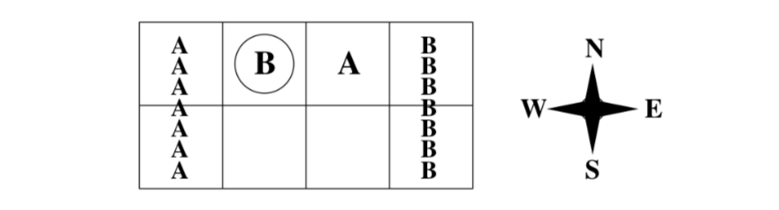
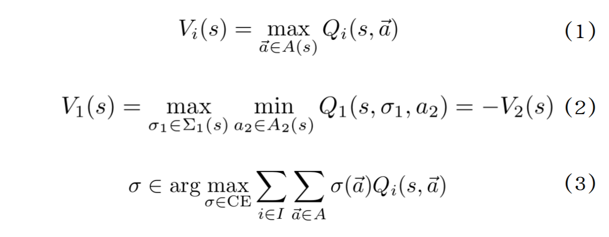
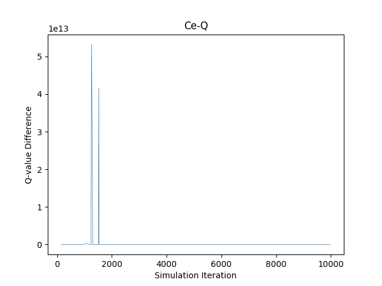
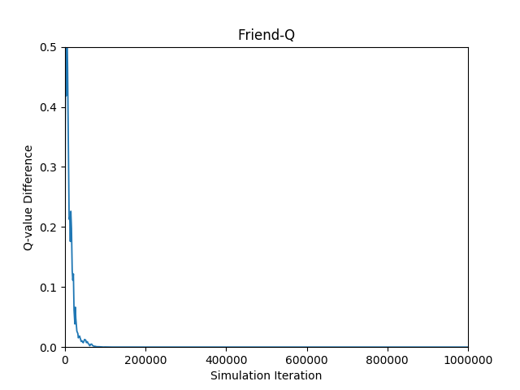
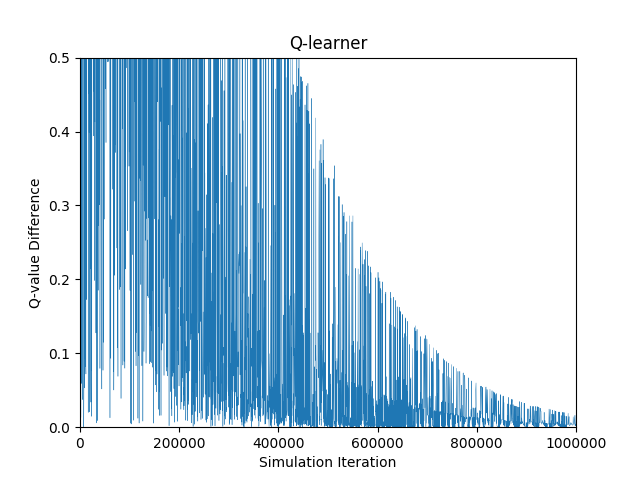

# Mini-soccer

Implementation of multiagent Correlated-Q(CE-Q), Foe-Q, Friend-Q, and regular Q-learning for playing a mini version of soccer game.

## Environment

The multi-step, zero-sum, grid-based soccer game is described in Greenwald and Hall’s 2003 paper\[1\].

The soccer field in this game is a 2 x 4 grid. The game starts with player A and B in state *s* where B has the ball and players move in random order. Both palyer choose from five action space, namely N, S, E, W, and stick simultaneously. If the player with the ball moves into his goal, he scores +100 and the other player gets -100. On the other hand, if he moves to the oppenent’s goal, he gets -100 and the opponent gets +100. In either case, the game ends. If this sequence of actions causes the players to collide, only the first player moves. The ball changes possession when the palyer without the ball moves first to where the one with the ball is.

## Friend-Q, Foe-Q and uCE-Q learning

Building on the basic concept of the plain Q learning algorithm, Friend-Q tried to max the Q value of a state by the joint actions of both players so that the learning converges to collaborative equilibria. 

Foe-Q is a minimax Q learning process, in which a player takes actions to maximize self payoff and minimize the opponent payoff.

Proposed by Greenwald’s paper, the Correlated Equilibrium (CE) aims at generalizing over the Nash and Foe Equilibria. In a two-player game for example, CE attempts to estimate the joint probability distribution.
CE-Q learning is an algorithm based on the correlated equilibrium, which aims at generalizing over the Nash and Foe Equilibria. uCE-Q is one of the CE-Q algorithms that applies on objective function that maximize the sum of the
players’ rewords.

## Implementation

The experiments are implemented and tested with python3.5. 

The plain Q learner was crafted out as an *ϵ*-greedy on-policy update method picking pure strategy, decayed both epsilon and learning rate approaching 0.001.
Friend-Q, Foe-Q and uCE-Q were coded as off-policy algorithms with completely random action selection. These learners are implemented using the corresponding equations(Eq.1-3). Linear programming (LP) is used to solve the V functions for Foe-Q and uCE-Q.

## Play the game

To play the game with a specific learner, run one of the following:

`$ python Q.py`

`$ python ceQ.py`

`$ python friendQ.py`

`$ python feoQ.py`

## Experiments

In the following experiment, the convergence of each algorithm is evaluated by comparing the error(the update of values in Q-table) during the learning. 

For Q learning, the plot reflects player A’s Q-values, corresponding to state s and action S, and for other algorithms, it reflects player A’s Q-values corresponding to states, with player A taking action S and player B sticking. Each experiment
is run for 106 time steps.

## Reference

\[1\] Greenwald, A. and Hall, K. Correlated Q-Learning. 2003. 

\[2\] Greenwald, A., Hall, K. and Zinkevich, M. Correlated-Q learning. 2007.

\[3\] Littman, M. Friend or foe Q-learning in general-sum Markov games.2001. 

\[4\] Littman, M. Markov games as a framework for multi-agent reinforcement learning. 1994.

