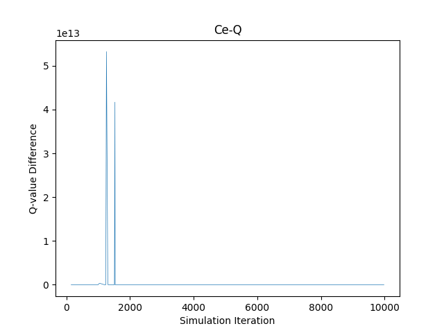
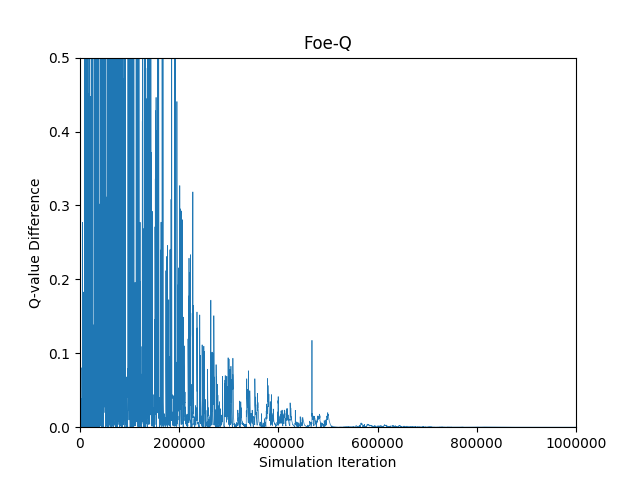

## Abstract

This paper reports the implementation and replication of the experiment of playing the soccer game using different Q-learning agents as describes in Greenwald and Hall's 2003 paper^[1]^. This include the soccer game environment and agents capable of Correlated-Q (CE-Q), Foe-Q, Friend-Q, and Q-learning. In consistent with the paper, our experiments show that Q-learning does not converge, Friend-Q converges to a deterministic policy for player B at the initial state *s* shortly after the learning starts, and Foe-Q also converge. Unfortunately, we are not able to reproduce the results of CE-Q as the error explodes. We also show that the settings of experimental conditions such as learning rate, $\gamma$ and initialization of the Q-tables are crucial to the reproduction of the figures.

## 1 The problem

The problem discussed in this paper is to build Q-learning agent and other three multiplayer Q learning algorithms, namely the utilitarian correlated equilibrium Q learning algorithms (uCE-Q), Friend-Q and Foe-Q learning to play the multi-step, zero-sum, grid-based soccer game ^[1,2]^. 

![Soccer Game. State *s*^[1]^](fig1.png){width=40%}

The soccer field in this game is a 2 x 4 grid. The game starts with player A and B in state *s* shown in Fig.1 ^[1]^ where B has the ball and players move in random order. Both palyer choose from five action space, namely N, S, E, W, and stick simultaneously. If the player with the ball moves into his goal, he scores +100 and the other player gets -100. On the other hand, if he moves to the oppenent's goal, he gets -100 and the opponent gets +100. In either case, the game ends. If this sequence of actions causes the players to collide, only the first player moves. The ball changes possession when the palyer without the ball moves first to where the one with the ball is.

In this experiment, we want to simulate this soccer game environment and reproduce the experiments in Figure 3 in Greenwald's paper^[1]^ using python implementation of the uCE-Q, Friend-Q, Foe-Q and Q learning algorithm.

## 2 Algorithms and Implementation

### 2.1 uCE-Q, Friend-Q, Foe-Q and Q learning

The general multiagent Q-Learning algorithm is described in Figure 2 ^[1]^ where the value function *V* is computed in different ways according to different algorithms. With Friend-Q, the *V* function is computed by Eq. 1^[1,3]^, Foe-Q  is by Eq.2^[1,4]^ and uCE-Q with Eq.3^[1]^.

Building on the basic concept of the plain Q learning algorithm, Friend-Q tried to max the Q value of a state by the joint actions of both players so that the learning converges to collaborative equilibria. Foe-Q is a minimax Q learning process, in which a player takes actions to maximize self payoff and minimize the opponent payoff. 

Proposed by Greenwald's paper, the Correlated Equilibrium (CE) aims at generalizing over the Nash and Foe Equilibria. In a two-player game for example, CE attempts to estimate the joint probability distribution. CE-Q learning is an algorithm based on the correlated equilibrium, among which uCE-Q applies on objective function that maximize the sum of the players' rewords (Eq.3). 

{width=50%} {width=50%}
                              
                               Figure 2: Multiagent Q-Learning[1]

### 2.2 Implementation

### 2.2.1 Soccer game 

The game environment contains *(4x2)x(4x2)x2* states, each represented as *[bAB]* in which b is the ball possession status and A and B are the position of player A and B. The initial state of environment is presented in Figure 1, where B has the ball and the order of move is shuffled each time after both player have moved. The action sequence (*{'A': action_A, 'B': action_B}*) is determined simultaneously at the beginning of each time step. 

In each episode, the game is reset to its initial state. During the learning process, the game simulator take the A/B action pair as input, and returns the next state as a result of the actions, the reward and the goal status ('done' or not).

### 2.2.2 Q-learners

The experiments are implemented with python. Based on the paper, uCE-Q, Foe-Q and the “mixed strategy” version Friend-Q were coded as off-policy algorithms with completely random action selection. The plain Q learner was crafted out as an $\epsilon$-greedy on-policy update method picking pure strategy, decayed both epsilon and learning rate approaching 0.001. Friend-Q, Foe-Q and uCE-Q are implemented according to Figure 2 using the corresponding equations(Eq.1-3). Linear programming (LP) is used to solve the V functions for Foe-Q and uCE-Q.

As for hyperparameters, learning rate is set to decay exponentially form 1.0 to 0.001 during the entire learning process. For Q learning $\epsilon$ is also set to decay exponentially form 1.0 to 0.001. The discount factor, $\gamma$, is set to 0.9 as described in Greenwald's paper. 

The Q-table is initialized with the shape of (state, action) for each player in Q learning, and of (state, action_A, action_B) for the other learners, where action_A and _B represants the actions of palyer A and B. Each player maintains his own Q table. For all learners, the value in the tabels are initialized as 1.0^[4]^.

## 3 Experiments and results

### 3.1 Experiments

The experiments aim to investigate the performance of uCE-Q, Friend-Q and Foe-Q and plain Q learning on the soccer game. The convergence of each algorithm is evaluated by comparing the error(the update of values in Q-table) during the learning. We want to reproduce the plots shown in Figure 3 in which the values on the x-axis represent time steps, and the corresponding
y-values are the error. For Q learning, the plot reflects player A’s Q-values, corresponding to state s and action S, and for other algorithms, it reflects player A’s Q-values corresponding to state s, with player A taking action S and player B sticking. Each experiment is run for 10^6^ time steps and the results are shown in Figure 3.

{width=50%} {width=50%}

{width=50%}{width=50%}
          
                      Figure 3: Convergence in the soccer game

## 3.2 Results and discussion

The results of Friend-Q and Foe-Q and Q learning are well replicated(Fig. 3) with minor differences. However, our implementation of uCE-Q learner is not able to converge in the soccer game. 

### 3.2.1 Q learning

For Q learning, both player learn his Q table separately and hence no optimal solution of the game can be found. The results shown in Fig.3 is consistent with that in the paper: the errors during learning drop slowly with the decrease of the learning rate, but never converge.

### 3.2.2 Friend-Q

For Friend-Q learning, the learning converges to a converges to a deterministic policy for player B taking action E at state s. In this algorithm, both player assume that the opponent chooses to take an action that maximize each other's reward, so both players search for collaborative equilibria in the joint action space. Therefore, the learning converges rapidly as expected. 

Noted that the plot of our experiment is not so smooth as the one in Greenwald's paper, this may results from the different experiment setting such as hyperparameters and Q-table initialization that are not described in details in the paper.

### 3.2.3 Foe-Q

As expected, Foe-Q converges to nondeterministic policies for both players, where they randomly select action between S and sticking. The Foe-Q implements possibly mixed strategies by sampling from a probability distribution over actions conditioned on the state to  maximize the minimum value obtainable with respect to the action space of the opponent.

### 3.2.4 uCE-Q

Unfortunately, the results of uCE-Q is not reproduced. This Non-convergence is further confirmed by the faster dropping learning rate and fixed learning rates, or enveloped errors as flat profile and thus small enough learning rate setting should not affect the convergence. The Q values exploded rapidly during learning, likely due to wrong constrains applied to LP or bad hyperparameters such as the learning rate or the Q initialization in the tables. Besides, due to the complexity of the constrains used to solve the LP, this experiment is very slow and takes a lot of resource.

## 3.3 Problems and pitfalls

### 3.3.1 Learning rate and decay schedule

Apart from the correct implement of game environment and learners, I found that proper setting of learning rate and its decay schedule is crucial for the replication of Greenwald's results. One of the reason is that the learner can be sensitive to learning rate to avoid oscillation or local minima, another is the learning rate is included in the error. A very small learning rate can fake the convergence of the learning. 

Unfortunately, neither the start point of learning rate nor the decay schedule is given in the paper. The only information provided is that the learning rate decays approaching 0.001. In most of my experiments, I set learning rate to decay exponentially form 1.0 to 0.001 during the entire learning process to get as close results as possible. However, for Friend-Q learner, I have to start with a small learning rate(0.05) and gradually decay to 0.001 in order to slow down the convergence and make my plot as close to that in Greenwald's paper, as my learning converges a little earlier.

### 3.3.2 Update rule for Q table

In Greenwald's paper, a (1-$\gamma$) factor is applied to reward(Fig.2). This can be a approach to prevent the reward from being too large, and hence promote better learning and convergence. For example, if I remove this (1-$\gamma$) factor from the update rule of my Friend Q learner, I can slower convergence, making my plot even closer to the one in Greenwald's paper.Similar slowly updated method also proved to be able to improve the learning performance. If I had more time, I would explore and play around with such strategies.

### 3.3.3 Initialization of Q table

The initialization of the values in Q table can impact the learning error to some extent. Normally we sample random values with normal distribution around 0 or set all values to 0. Improper setting of initial values can introduce bias and therefore impact the errors. In my experiment, I found that different initial values in the Q table produces sightly different plots, but unfortunately again, this information is not provided by the author. I initialize my Q tables according to Littman's paper^[4]^ to all 1.0. It turns out to be working well to reproduce the figures in Greenwald's paper. 

## Link of the code:

https://github.gatech.edu/yliu3082/CS7642_project3.git
  
  
  
## Reference

[1] Greenwald, A. and Hall, K. Correlated Q-Learning. 2003.
[2] Greenwald, A., Hall, K. and Zinkevich, M. Correlated-Q learning. 2007.
[3] Littman, M. Friend or foe Q-learning in general-sum Markov games. 2001. 
[4] Littman, M. Markov games as a framework for multi-agent reinforcement learning. 1994.

